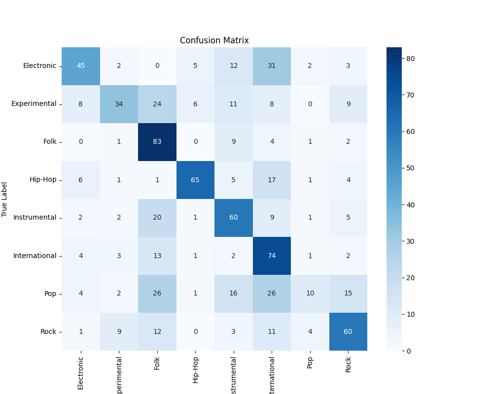
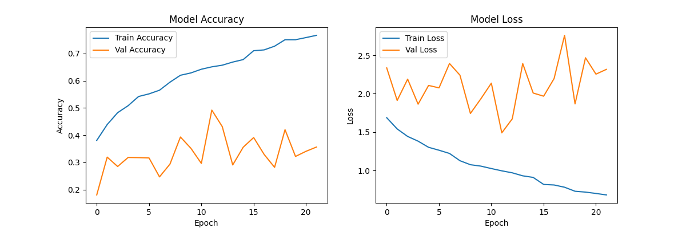

# Music Genre Classification (SongNet)

A robust Deep Learning system that classifies music genres from raw audio using a hybrid **CNN + GRU + Attention** architecture. The project includes a full training pipeline, real-time visualization app, and edge deployment support.

## 🚀 Key Features
- **Advanced Architecture**: Combines **1D-CNNs** (feature extraction), **GRU** (temporal modeling), and **Self-Attention** (context weighting) for superior performance.
- **End-to-End Pipeline**: From raw audio processing to model inference.
- **Interactive Web App**: Streamlit-based UI with real-time **waveform visualization** and **metadata display** (Artist/Year).
- **Edge Deployment**: Includes scripts to convert the trained model to **TensorFlow Lite (.tflite)**.

## 🎵 Model Architecture
1.  **Input**: Log Mel-spectrograms (128 mel bins, 30s duration).
2.  **Feature Extraction**: 3x Conv1D Blocks (Conv -> BN -> ReLU -> Dropout -> MaxPool).
3.  **Temporal Modeling**: **GRU** (Gated Recurrent Unit) layer to capture time-series patterns.
4.  **Attention Mechanism**: **Self-Attention** layer to focus on the most relevant parts of the track.
5.  **Classification**: Dense Output Layer (Softmax) for 8 genres.

## 📂 Project Structure
```
SongNet/
├── data/
│   ├── fma_small/          # Audio files
│   └── fma_metadata/       # tracks.csv
├── music_genre_classifier/
│   ├── preprocess.py       # Metadata & Spectrogram extraction
│   ├── model.py            # SongNet (CNN+GRU+Attention) definition
│   ├── train.py            # Training loop with callbacks
│   ├── predict.py          # Inference logic
│   ├── benchmark.py        # Model benchmarking script
│   ├── app.py              # Streamlit Web App
│   ├── convert_tflite.py   # TFLite conversion script
│   ├── requirements.txt    # Dependencies
│   ├── confusion_matrix.png # Generated plot
│   └── training_history.png # Generated plot
├── X.npy, y.npy            # Processed Datasets
├── classes.npy             # Label classes
├── metadata.json           # Track metadata (Artist/Year)
├── best_model.h5           # Trained Model
└── songnet.tflite          # Edge Model (TFLite)
```

## � Installation & Setup

1.  **Install Dependencies**:
    ```bash
    pip install -r music_genre_classifier/requirements.txt
    ```
2.  **Prepare Dataset**:
    Ensure `fma_small` and `fma_metadata` are located in `data/`.

## ⚡ Usage

### 1. Data Preprocessing
Extracts mel-spectrograms and metadata (Artist/Year) from raw audio.
```bash
python music_genre_classifier/preprocess.py
```

### 2. Training
Trains the SongNet model (with GRU + Attention) and saves to `best_model.h5`.
```bash
python music_genre_classifier/train.py
```

### 3. Run Web App
Launch the interface to upload songs, see waveforms, and get predictions.
```bash
streamlit run music_genre_classifier/app.py
```

### 4. Edge Deployment (TFLite)
Convert the trained model for mobile/edge use.
```bash
python music_genre_classifier/convert_tflite.py
```

## 🏆 Performance & Benchmarks

### Observations
-   **Superior Performance**: SongNet (CNN+GRU+Attn) achieves **53.9%** accuracy, outperforming the best baseline (Logistic Regression ~50%) and significantly beating KNN/SVM.
-   **Feature Extraction**: CNN layers successfully distinguish spectral characteristics of genres like Electronic vs. Folk.
-   **Attention**: The attention mechanism helps the model focus on chorus/hook sections versus silent intros.

### Visual Results

_Figure 1: Confusion Matrix showing per-class performance_


_Figure 2: Training Accuracy and Loss over epochs_

### Model Comparison
| Model                       | Accuracy    |
|-----------------------------|-------------|
| Random                      | 11.8%       |
| KNN                         | 38.0%       |
| SVM                         | 45.4%       |
| Logistic Regression         | 50.0%       |
| **SongNet (CNN+GRU+Attn)**  | **53.9%**   |

### Model Size Comparison
| Format                      | Size        |
|-----------------------------|-------------|
| CNN + LSTM (.h5)            | ~4.3 MB     |
| CNN + GRU + Attention (.h5) | ~3.7 MB     |
| **SongNet Edge (TFLite)**   | **~1.2 MB** |
